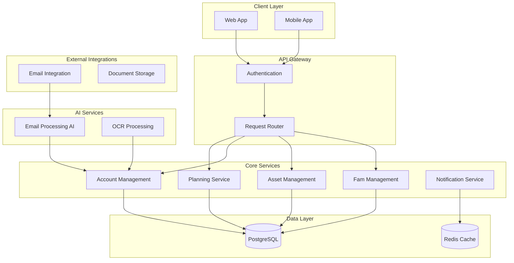

# FamSpace Design Document

## Overview

FamSpace is a multi-tenant household administration platform built around the concept of "Fams" (family units) that manage shared assets and individual member accounts. The system uses AI-powered email integration and OCR to automate data capture while providing flexible data models to accommodate diverse UK household structures.

## Architecture

### High-Level Architecture



### Technology Stack

- **Backend**: Node.js with TypeScript, Express.js
- **Database**: PostgreSQL with Prisma ORM
- **Cache**: Redis for session management and notifications
- **AI Integration**: OpenAI GPT-4 for email processing
- **OCR**: Google Cloud Vision API or AWS Textract
- **Authentication**: JWT with refresh tokens
- **File Storage**: AWS S3 or similar cloud storage
- **Email Integration**: IMAP/OAuth2 for Gmail, Outlook

## Components and Interfaces

### Core Domain Models

#### User
```typescript
interface User {
  id: string
  email: string
  name: string
  createdAt: Date
  updatedAt: Date
  famMemberships: FamMembership[]
}
```

#### Fam (Family Unit)
```typescript
interface Fam {
  id: string
  name: string
  createdAt: Date
  updatedAt: Date
  members: FamMembership[]
  assets: Asset[]
  plans: Plan[]
}

interface FamMembership {
  id: string
  userId: string
  famId: string
  role: 'admin' | 'member'
  joinedAt: Date
}
```

#### Asset
```typescript
interface Asset {
  id: string
  famId: string
  type: 'home' | 'vehicle' | 'custom'
  name: string
  description?: string
  customFields: Record<string, any>
  accounts: Account[]
  createdAt: Date
  updatedAt: Date
}
```

#### Account
```typescript
interface Account {
  id: string
  assetId?: string // null for personal accounts
  userId?: string // for personal accounts
  famId: string
  accountHolderId: string // User ID
  type: AccountType
  name: string
  provider: string
  accountNumber?: string
  dueDate?: Date
  amount?: number
  expiryDate?: Date
  customFields: Record<string, any>
  documents: Document[]
  createdAt: Date
  updatedAt: Date
}

type AccountType = 
  | 'council_tax'
  | 'home_insurance' 
  | 'energy_bill'
  | 'tv_package'
  | 'factoring'
  | 'life_insurance'
  | 'mobile_contract'
  | 'will_testament'
  | 'custom'
```

#### Plan
```typescript
interface Plan {
  id: string
  famId: string
  type: 'holiday' | 'property_move' | 'custom'
  name: string
  description?: string
  startDate?: Date
  endDate?: Date
  status: 'planning' | 'in_progress' | 'completed'
  customFields: Record<string, any>
  tasks: PlanTask[]
  createdAt: Date
  updatedAt: Date
}

interface PlanTask {
  id: string
  planId: string
  title: string
  description?: string
  assignedToId?: string
  dueDate?: Date
  completed: boolean
  createdAt: Date
}
```

### API Interfaces

#### Fam Management API
```typescript
interface FamAPI {
  createFam(data: CreateFamRequest): Promise<Fam>
  inviteUser(famId: string, email: string): Promise<Invitation>
  joinFam(invitationToken: string): Promise<FamMembership>
  getFamDetails(famId: string): Promise<Fam>
  updateFam(famId: string, data: UpdateFamRequest): Promise<Fam>
}
```

#### Asset Management API
```typescript
interface AssetAPI {
  createAsset(famId: string, data: CreateAssetRequest): Promise<Asset>
  getAssets(famId: string): Promise<Asset[]>
  updateAsset(assetId: string, data: UpdateAssetRequest): Promise<Asset>
  deleteAsset(assetId: string): Promise<void>
}
```

#### Account Management API
```typescript
interface AccountAPI {
  createAccount(data: CreateAccountRequest): Promise<Account>
  getAccounts(famId: string): Promise<Account[]>
  updateAccount(accountId: string, data: UpdateAccountRequest): Promise<Account>
  deleteAccount(accountId: string): Promise<void>
  processEmailBill(emailData: EmailData): Promise<Account | null>
  processOCRDocument(imageData: Buffer): Promise<OCRResult>
}
```

### AI Integration Components

#### Email Processing Service
```typescript
interface EmailProcessor {
  analyzeEmail(emailContent: string, famContext: FamContext): Promise<BillAnalysis>
  extractBillData(emailContent: string): Promise<BillData>
}

interface BillAnalysis {
  isRelevant: boolean
  confidence: number
  suggestedAccountType: AccountType
  extractedData: BillData
}

interface BillData {
  provider: string
  amount?: number
  dueDate?: Date
  accountNumber?: string
  billPeriod?: string
}
```

#### OCR Processing Service
```typescript
interface OCRProcessor {
  processDocument(imageBuffer: Buffer): Promise<OCRResult>
  extractBillInformation(ocrText: string): Promise<BillData>
}

interface OCRResult {
  extractedText: string
  confidence: number
  billData: BillData
  suggestedAccountType: AccountType
}
```

## Data Models

### Database Schema Design

The system uses PostgreSQL with the following key design decisions:

1. **Multi-tenancy**: All data is scoped to Fams, ensuring data isolation
2. **Flexible Schema**: Custom fields stored as JSONB for extensibility
3. **Audit Trail**: Created/updated timestamps on all entities
4. **Soft Deletes**: Important records are soft-deleted for data recovery

### Key Relationships

- Users can belong to multiple Fams (many-to-many through FamMembership)
- Assets belong to one Fam and can have multiple Accounts
- Accounts can be asset-specific or personal (user-specific)
- Plans belong to one Fam and contain multiple tasks
- Documents can be attached to Accounts for bill storage

### UK-Specific Considerations

- Council tax bands and local authority integration
- Energy supplier switching tracking
- Insurance renewal cycles (typically annual)
- Mobile contract end dates and upgrade eligibility
- Will and testament storage with secure access controls

## Error Handling

### Error Categories

1. **Validation Errors**: Invalid input data, missing required fields
2. **Authorization Errors**: Insufficient permissions, invalid tokens
3. **Business Logic Errors**: Duplicate accounts, invalid state transitions
4. **External Service Errors**: AI service failures, email connection issues
5. **System Errors**: Database connectivity, unexpected server errors

### Error Response Format

```typescript
interface ErrorResponse {
  error: {
    code: string
    message: string
    details?: Record<string, any>
    timestamp: string
    requestId: string
  }
}
```

### Resilience Patterns

- **Circuit Breaker**: For AI service calls (email processing, OCR)
- **Retry Logic**: For transient failures with exponential backoff
- **Graceful Degradation**: Manual entry when AI services are unavailable
- **Data Validation**: Client and server-side validation for data integrity

## Testing Strategy

### Unit Testing
- Service layer business logic testing
- Data model validation testing
- Utility function testing
- Mock external dependencies (AI services, email providers)

### Integration Testing
- API endpoint testing with test database
- Email processing workflow testing
- OCR processing pipeline testing
- Authentication and authorization flows

### End-to-End Testing
- Complete user workflows (create Fam, add assets, process bills)
- Cross-browser compatibility testing
- Mobile app functionality testing
- Performance testing under load

### Test Data Management
- Anonymized UK household data for realistic testing
- Mock email samples for AI training validation
- Sample bill images for OCR testing
- Performance test scenarios with multiple Fams and users

### Security Testing
- Authentication bypass attempts
- Data access control validation
- Input sanitization testing
- File upload security testing
- API rate limiting validation